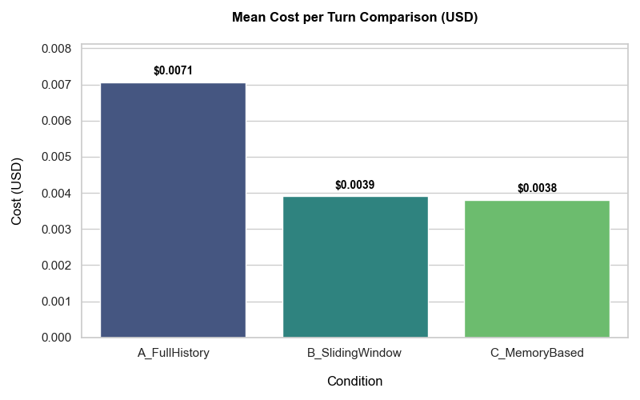
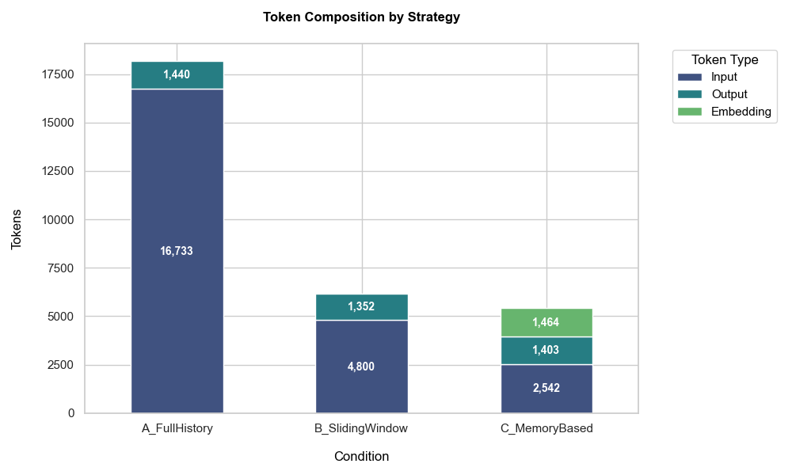
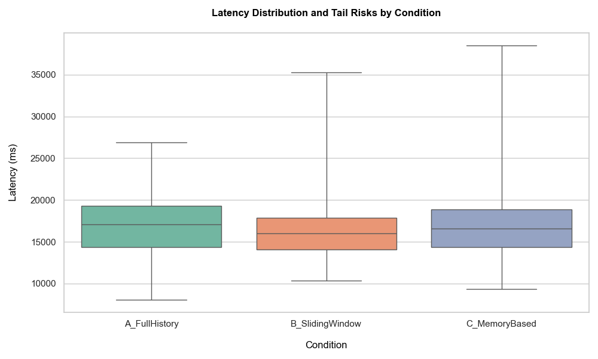
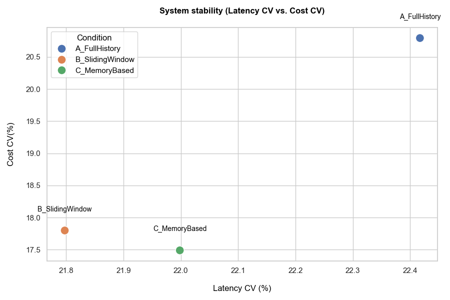

# Experiment 1: Comparative Evaluation of Context Management Strategies

### Abstract

This study quantitatively evaluates the operational trade-offs of three context management strategies—Full History, Sliding Window, and Memory-Based Retrieval—in Large Language Model (LLM) conversational systems. Utilizing the gpt-5-mini model under controlled experimental conditions, we analyzed cost efficiency, token consumption, and system stability across 375 episodes designed to test long-term recall under semantic distraction. The results demonstrate that managed strategies (Sliding Window and Memory-Based) reduce operational costs by approximately 46% compared to the unmanaged Full History baseline. However, this efficiency comes with distinct stability profiles: while Sliding Window offers the most predictable latency, Memory-Based retrieval introduces significant "tail latency" risks (2.32x worst-case amplification) due to the overhead of vector operations. These findings provide a data-driven framework for selecting architectural patterns that balance financial sustainability with Quality of Service (QoS).

## Experimental Design

### 1. Introduction

As Large Language Models (LLMs) are increasingly integrated into complex, long-running conversational systems, the management of the context window has emerged as a critical architectural challenge. While providing a model with the complete history of an interaction ensures maximum information retention, this "brute-force" approach leads to a linear escalation in computational costs and processing latency. Furthermore, it risks exceeding the model's native context limits, eventually rendering the agent inoperable or prone to hallucinations in extended sessions.

To mitigate these constraints, developers often employ context management strategies designed to prune or selectively retrieve historical information. However, there remains a lack of rigorous, turn-by-turn quantitative data comparing the trade-offs between deterministic pruning and dynamic retrieval systems. This study addresses this gap by evaluating three archetypal strategies: `Full History`, representing the unmanaged baseline; `Sliding Window`, a deterministic temporal pruning method; and `Memory-Based Retrieval`, a dynamic RAG-lite (Retrieval-Augmented Generation) approach.

The primary objective of this experiment is to quantitatively compare these strategies across two distinct but interconnected axes: Operational Efficiency and System Stability. By utilizing a controlled workload designed to test long-term recall under heavy semantic distraction (the `cs_v1_EARLY` script), this research measures the per-turn financial impact (token consumption and cost) and technical reliability (latency variance and tail amplification) of each configuration. This report provides a data-driven framework for selecting context management logic that balances economic sustainability with a high-quality, predictable user experience.

### 2. Definitions and Terminology
To ensure semantic precision throughout the experimental suite, the following terms are defined:

- **Configuration:** A specific instance of a Strategy with fixed parameters.
- **Episode:** A single execution of the Experimental Script using a specific Strategy under a specific Configuration.
- **Episode Record:** A record of the output data obtained after running an Episode.
- **Experiment:** A container that groups multiple Episodes for various Configurations, all sharing the same underlying Script. It typically includes multiple repetitions per configuration to ensure statistical significance.
- **Experimental Script:** The subset of the Script not included in the History. These messages are processed turn-by-turn during the measurement phase.
- **History:** A static prefix constructed by taking a portion of the Script and pairing it with pre-generated Assistant responses. This simulates a pre-existing conversation state.
- **Script:** An ordered sequence of User-side messages only. It represents the raw input and serves as the immutable input source.
- **Strategy:** The algorithmic approach used to manage context.
- **Suite:** The root container. It stores references to all Experiments, metadata, global configurations, and the raw content and hashes (SHA-256) of all Experimental Scripts and Histories to ensure reproducibility.
- **Turn:** The smaller unit of interaction. It involves sending a User message from the Experimental Script and receiving an Assistant response.

### 3. Research Questions (RQs)
   - **RQ1:** How does the choice of context management strategy affect the rate of cost accumulation as conversation depth increases?
   - **RQ2:** Which configuration provides the most predictable latency and token usage across multiple repetitions?
   - **RQ3:** What is the "System Token" tax introduced by memory-based retrieval (K fragments) compared to a standard sliding window?
   - **RQ4:** Does the added complexity of vector retrieval significantly impact latency stability compared to deterministic windowing?

### 4. Hypotheses (H)
- **H1:** `A_FullHistory` will yield the highest average cost per turn, while `B_SlidingWindow` and `C_MemoryBased` will maintain significantly lower and comparable cost averages.
- **H2:** `B_SlidingWindow` will exhibit the lowest Coefficient of Variation (CV) in latency, as its payload is constant and deterministic.
- **H3:** `C_MemoryBased` will show the highest Tail Amplification (p95) for latency due to the non-deterministic nature of embedding generation and vector search.
- **H4:** `C_MemoryBased` will result in higher system tokens per turn than `B_SlidingWindow` due to the overhead of injecting retrieved context fragments.

## Protocol and Technical Specification

### 5. Script `cs_v1_EARLY` Specification
All scripts in this suite were generated to evaluate the "Long-term Recall vs. Distraction" trade-off.
1. **Phase 1 (Early):** Critical, non-inferable facts (dates, names, specific constraints)
2. **Phase 2 (Middle):** Heavy semantic noise (distractor topics) comprising the majority of the .
3. **Phase 3 (Late):** Implicit recall questions that require accessing Phase 1 facts.

### 6. Strategies evaluated

The following strategies were implemented to manage the LLM's context window:

1. **Full History**
   - **Logic:** Includes every prior turn (both from the History and the current Episode) verbatim in the prompt.
   - **Goal:** Serve as the control group (Baseline) with maximum content retention but linear cost growth.
2. **Sliding window**
   - **Logic:** Limits the context to the most recent N messages. As new turns occur, the oldest messages are evicted from the prompt.
   - **Goal:** Evaluate the impact of context loss on recall while maintaining a predictable and capped token cost.
3. **Memory-Based Retrieval**
   - **Logic:** Uses a vector database to store the history and previous turns. For each new turn, it retrieves the K most semantically relevant fragments using cosine similarity and the most recent N messages. Uses `text-embedding-3-small` to obtain the embedding vector. No summarization or memory compression is performed by the strategy.
   - **Goal:** Evaluate if selective retrieval can maintain high recall of "early facts" (from the `cs_v1_EARLY` script) without the cost of a full history.

### 7. Experimental Configurations
For this suite, we evaluate the following four configurations of the strategies:
- **Full History** `A_FullHistory`
   - All prior turns are included.
- **Sliding Window** `B_SlidingWindow`
   - N = 6
   - Only the last six turns (12 messages) are kept.
- **Memory-Based Retrieval** `C_MemoryBased`
   - N = 4, K = 3
   - Last 4 messages + 3 retrieved fragments.

### 8. Technical Configuration and Pricing
**Models:**
- **LLM:** `gpt-5-mini` (Reasoning Effort: `medium`)
- **Embeddings:** `text-embedding-3-small` (1536 dimensions)

**Pricing (per 1M tokens):**
- **LLM Input:** $0.25
- **LLM Output:** $2.00
- **Embeddings:** $0.02

### 9. Execution Environment
- **Operating System:** Linux (Ubuntu server 24.04 LTS)
- **Infrastructure:** Azure VM (Standard D2ads v6).
- **Region:** East US 2 (Zone 2).
- **Concurrency:** Serial execution (1 thread) to prevent client-side rate limit throttling from skewing latency data.

### 10. Data Integrity and Metrics
**Aggregated Metrics:** Episodes are grouped by Condition (Configuration) to compute statistical tendencies.
- Token Metrics: Input, Output, Embedding, Total LLM, and Total System Tokens.
- Financial Metrics: Estimated Cost in USD (based on Section 8).
- Temporal Metrics: Execution Time and Latency (ms).

**Stability Metrics:** Specific stability metrics are calculated for Cost, Tokens and Latency.
- CV (Coefficient of Variation): Measures relative variability.
- IQR (Interquartile Range): Robust measure of statistical dispersion.
- Tail Amplification (P95): Measures how extreme the worst 5% of turns are compared to the median.
- Worst Case Amplification: Ratio of the maximum observed value to the median.

**Integrity Report:** Before analysis, the dataset undergoes validation. An Episode Record is flagged as invalid and excluded from aggregation if it has zero turns, negative values, or missing fields.

## Results Analysis

### 11. Data Integrity and Validation
The experimental suite concluded with a total of 375 episodes processed over an execution window of approximately 27 hours of serial processing. Every episode across the three conditions successfully met the validation criteria, resulting in zero rejected records. This 100% integrity rate ensures that the session-wide averages and stability metrics are not skewed by incomplete conversation flows or API failures, providing a robust foundation for the following comparative analysis.

| Metric | Value |
| --- | --- |
| Total Episodes Processed | 375 |
| Valid Episodes | 375 |
| Invalid Episodes | 0 |
| Primary Rejection Reason | N/A |

### 12. Resource Efficiency
This section evaluates the economic and computational footprint of each strategy.

**Comparative Token and Cost Metrics (Mean per Turn)**
| Configuration | Input Tokens | Output Tokens | Embedding Tokens | Total Cost (USD) |
| --- | --- | --- | --- | --- |
| A_FullHistory | 16733 | 1440 | 0 | $0.0071 |
| B_SlidingWindow | 4800 | 1352 | 0 | $0.0039 |
| C_MemoryBased | 2542 | 1403 | 1464 | $0.0038 |
 

<picture>
   <source media ="(prefers-color-scheme: dark)" srcset="./graphics/mean_cost_dark.png">
   
</picture>

<picture>
   <source media ="(prefers-color-scheme: dark)" srcset="./graphics/token_composition_dark.png">
   
</picture>

 
The economic analysis reveals a dramatic shift in operational costs when moving away from unmanaged context. The A_FullHistory` configuration established an expensive baseline, averaging $0.0071 per turn. In contrast, both `B_SlidingWindow` and `C_MemoryBased` achieved a significant reduction in financial footprint, hovering around $0.0038 and $0.0039, respectively. This represents a cost efficiency gain of approximately 46%.

Analyzing the token composition explains this divergence: while the baseline scales linearly with history, the `Memory-Based` strategy aggressively minimizes the Input Token count by substituting it with much cheaper Embedding Tokens. Even though `C_MemoryBased` incurs a persistent system tax of 1,464 embedding tokens per turn, the lower pricing tier of the `text-embedding-3-small` model allows it to remain cost-competitive with the simpler `Sliding Window` approach. Interestingly, the output generation remained remarkably consistent across all strategies at 1,400 tokens per turn, suggesting that the volume of the model's response is independent of the specific context management logic employed.

### 13. Operational Stability and Latency Performance

| Configuration | Latency Mean (ms) | Latency CV (%) | Latency Worst Case Amp | Cost CV (%) |
| --- | --- | --- | --- | --- |
| A_FullHistory | 16853 | 22.4% | 1.57x | 20.8% |
| B_SlidingWindow | 16304 | 21.8% | 2.20x | 17.8% |
| C_MemoryBased | 16878 | 22.0% | 2.32x | 17.5% |

 

<picture>
   <source media ="(prefers-color-scheme: dark)" srcset="./graphics/latency_distribution_dark.png">
   
</picture>

<picture>
   <source media ="(prefers-color-scheme: dark)" srcset="./graphics/stability_scatter_dark.png">
   
</picture>

 
Beyond simple averages, the stability metrics expose the true "Quality of Service" (QoS) trade-offs inherent in each strategy. All three configurations displayed a high degree of latency jitter, with a CV exceeding 21%, which is a characteristic of the `gpt-5-mini` model under `medium` reasoning effort. However, the B_SlidingWindow configuration emerged as the most predictable option, maintaining the lowest mean latency of 16,304 ms and the highest cost stability.

The most striking finding lies in the "tail risk" associated with vector-based memory. The `C_MemoryBased` configuration exhibited the most significant latency spikes, reaching a Worst Case Amplification of 2.32x compared to its median. This confirms the presence of a "Memory Penalty," where the non-deterministic overhead of generating embeddings and performing vector similarity searches can occasionally double the response time for a user. While `Full History` is the most expensive, its latency was surprisingly more "contained" in the worst-case scenario (1.57x amplification), likely because it avoids external database lookups and relies entirely on the transformer's native attention mechanism.

### 14. Conclusions and Strategic Recommendations
The transition from a full history model to managed context is a mandatory step for any production-grade conversational agent aiming for financial sustainability. The results of this experiment demonstrate that utilizing either a fixed sliding window or an RAG-lite memory system can effectively halve operational costs without drastically increasing the average response time. However, these cost savings are not free; they come at the expense of operational predictability. The choice between strategies should therefore be dictated by the specific "stability-to-recall" requirements of the application.

For applications where user experience is measured by consistent response times, the `Sliding Window` strategy is the superior choice. It provides the most deterministic resource usage and the lowest latency variance, making it ideal for real-time interfaces. Its deterministic nature ensures that the system load remains constant, which simplifies infrastructure scaling and budget forecasting. While it lacks the ability to reach into the deep past of a conversation, its operational reliability makes it the "safe bet" for most standard chat implementations.

Conversely, the `Memory-Based` strategy should be viewed as a high-value but high-variance alternative. It successfully bridges the gap between the cost-efficiency of windowing and the context-retention of a full history. Yet the high tail amplification observed in our data suggests that developers must implement robust error handling and perhaps "optimistic UI" patterns to mask the occasional latency spikes caused by the retrieval step. In summary, if the conversational goal requires retrieving specific facts from the initial stages of a long session (as in the `cs_v1_EARLY` script), the memory-based approach is worth the occasional performance jitter; otherwise, the simplicity and stability of the sliding window remain unmatched.